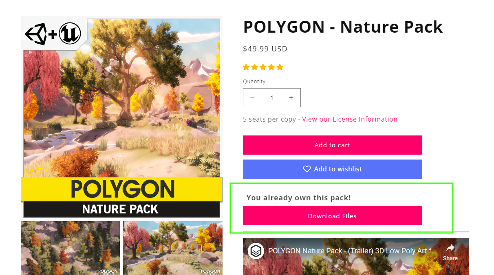
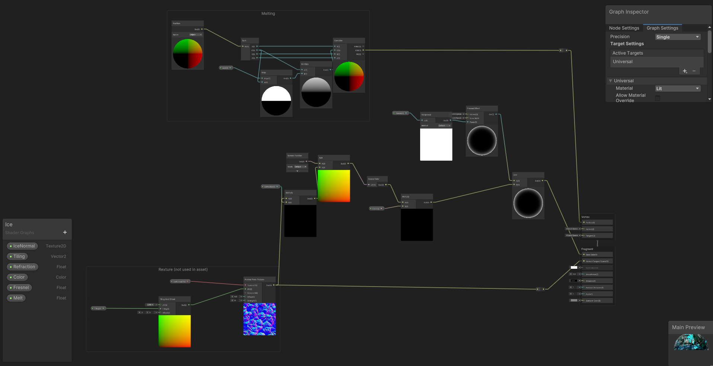
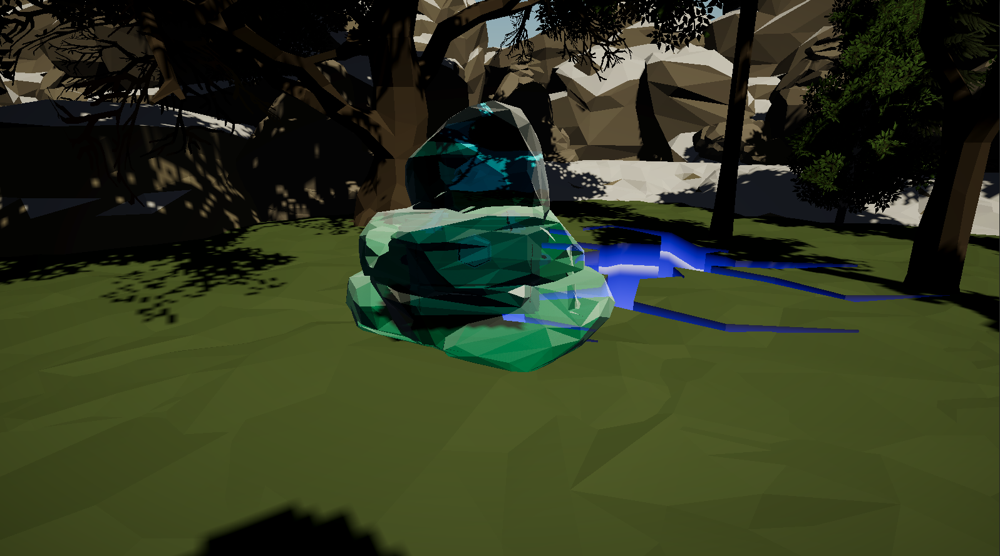

# Segundo Parcial de Efectos Visuales
## IMPORTANTE
todo que no este mencionado en la lista de "Efectos a tener en cuenta para el parcial"
es parte de paquetes comprados. El escenario esta hecho con
Assets comprados en [SyntyStore](https://syntystore.com/) de los cuales tengo licencia:

## Efectos a tener en cuenta para el parcial
### 1. Fogata
Es una fogata simple con dos sistemas de particulas, uno para la llama,
y otro para las chispas que salen.

Al pasar por encima el jugador se prende fuego, aplicando un filtro rojo sobre un post-proceso
de Vigniette que se aplica al ejecutar el juego a traves de codigo

### 2. Cristal de Hielo
Un Cristal de hielo el cual se derrite pasando por el fuego de la fogata
y acercandose al cristal.

El cristal distorisiona lo que se ve atras, y se aplana al derretirse usando
vertex offset.

### 3. Ver objetos a traves de la pared.
Un efecto de post-proceso simple que muestra ciertos assets de forma llamativa a
traves de las paredes cuando se encuentras tapados por otro objeto.

### 4. _**LA GRIETA**_
Esta esta marcada como ultima, debido a que fue principalmente sacada de un video de 
Gabriel Aguiar [_(Unity VFX - Ground Cracks | Fissure | Hole Effect Tutorial)_](https://www.youtube.com/watch?v=qiAiVa0HtyE)

Sin embargo, debido a que usa custom features de URP, utiliza un efecto interesante, y por sobre todo, me 
gusta como quedo, asi que lo agrego, sume o no puntos, me ayudo a entender que se puede hacer con estas features